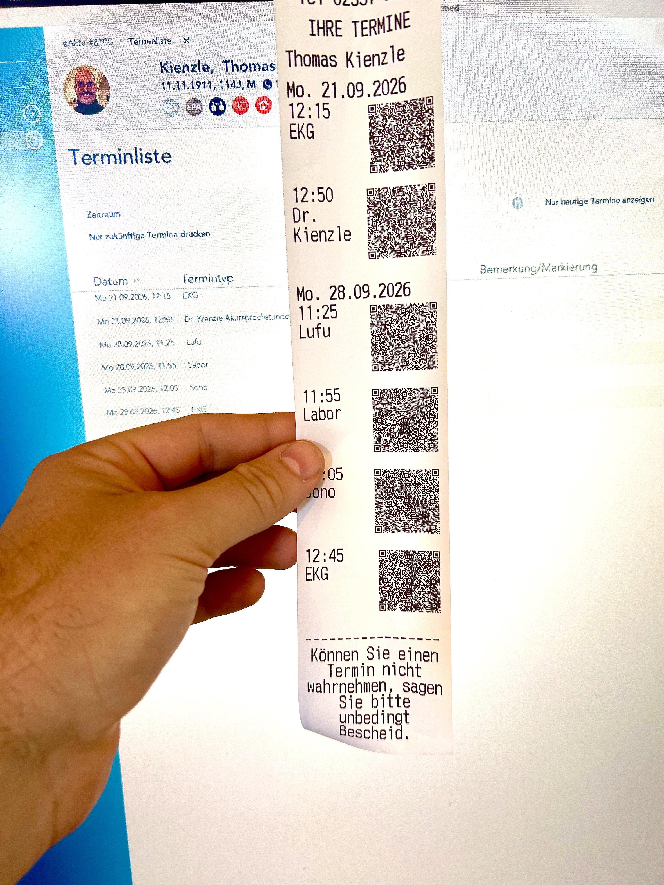

# T2med-Terminzettel 1.3

> [!IMPORTANT]
> **Zuerst den Bondrucker einrichten:** [Epson TM-m10 per Bluetooth unter Linux installieren und für macOS freigeben](https://github.com/thomaskien/t2med-sumup/blob/main/epson-tm-m10-bluetooth-linux-samba-macos.md).
>
> Voraussetzung für dieses Projekt ist eine funktionierende lokale CUPS-Warteschlange `TMm10`. Anschließend den Terminzettel-Installer ausführen und auf dem Mac den [virtuellen Drucker **Terminzettel** mit dem PDF-Treiber hinzufügen](#drucker-auf-dem-mac-hinzufügen).
>
> **OCR ist für Bild-PDFs aus T2med erforderlich:** Der Terminzettel-Installer installiert Tesseract mit deutschem Sprachpaket und die benötigten PDF-Werkzeuge automatisch. Eine vorhandene Installation, etwa durch kienzlefax, wird mitbenutzt. Eine separate OCR-Einrichtung ist nicht nötig. [Details zur Texterkennung](#automatische-texterkennung).

<p align="center">
  
</p>

In T2med **Terminzettel** als Drucker auswählen. Der Dienst druckt einen 58-mm-Bon über die vorhandene lokale CUPS-Warteschlange **TMm10**. Bild-PDFs aus T2med liest er bei Bedarf automatisch mit der lokal installierten Texterkennung. Auf Wunsch ergänzt er unter dem Datum links Uhrzeit und Terminart und rechts daneben einen kleinen Offline-Kalender-QR je Termin.

## Installation auf dem Raspberry Pi

Voraussetzung: Raspberry Pi OS mit Python ab 3.10, systemd und eine funktionierende lokale CUPS-Warteschlange `TMm10`. Bei älteren Systemen meldet der Installer, was fehlt.

### Download und Installation

[Projekt als Archiv herunterladen](https://github.com/thomaskien/t2med-terminzettel/archive/refs/tags/v1.3.tar.gz). Das gesamte Archiv wird benötigt, nicht nur das Installationsskript.

Direkt auf dem Raspberry Pi herunterladen, entpacken und installieren:

```bash
cd ~ &&
curl -fL https://github.com/thomaskien/t2med-terminzettel/archive/refs/tags/v1.3.tar.gz -o terminzettel-1.3.tar.gz &&
tar -xzf terminzettel-1.3.tar.gz &&
cd t2med-terminzettel-1.3/terminzettel-installer &&
sudo ./install-terminzettel.sh
```

Falls `curl` fehlt: `sudo apt-get update && sudo apt-get install -y curl`. Die übrigen benötigten Pakete installiert das Skript selbst, einschließlich Tesseract mit deutschem Sprachpaket. Eine vorhandene Tesseract-Installation (zum Beispiel durch kienzlefax) wird mitbenutzt; deren Konfiguration wird nicht verändert. Download und Paketinstallation benötigen Internet; der spätere Kalender-QR funktioniert offline. Wer bereits als `root` angemeldet ist, kann `sudo` weglassen.

Ist das Projekt bereits entpackt, im Unterordner `terminzettel-installer` einfach `sudo ./install-terminzettel.sh` ausführen.

Im Terminal fragt der Installer den Praxiskopf, die Kalender-QRs und den Fußtext ab. Bei eingeschalteten QR-Codes fragt er zusätzlich den **Präfix für den Kalender-Titel**, zum Beispiel „Praxis ABC“. Zusammen mit der Terminart „Lufu“ wird daraus „Praxis ABC: Lufu“. Enter übernimmt den bisherigen Präfix; ein einzelnes `-` entfernt ihn. Jeden Block mit **j/n** einschalten oder ausschalten. Kopf und Fuß können mehrere Zeilen haben; eine Leerzeile beendet die Eingabe. Enter als erste Eingabe übernimmt den angezeigten Text, ein einzelnes `-` leert ihn. Für einen bisher leeren Fußtext wird der unten gezeigte Hinweis vorgeschlagen. Bei Updates bleiben eigene Texte und Schalter als Vorgabe erhalten. Ohne interaktives Terminal gibt es keine Abfragen; vorhandene Werte bleiben bestehen und Neuinstallationen verwenden die Beispieldatei.

### Vorhandene Installation aktualisieren

Bei einem Download als Archiv die Download- und Installationsbefehle oben erneut ausführen. Einstellungen gehören nach `/etc/terminzettel/config.toml`; diese übernimmt der Installer beim Update.

Falls das Projekt mit Git nach `~/terminzettel` heruntergeladen wurde:

```bash
cd ~/terminzettel
git pull --ff-only
cd terminzettel-installer
sudo ./install-terminzettel.sh
```

Auch nach dem früheren Abbruch mit „cgroup v2 und Speichercontroller erforderlich“ genügt der aktuelle Download und ein erneuter Installationslauf. Die cgroup-/Swap-Sperre wurde entfernt; dafür ist kein Systemupdate erforderlich.

### Drucker auf dem Mac hinzufügen

Der Raspberry Pi gibt **Terminzettel** über CUPS und Bonjour frei. Auf dem Mac den mitgelieferten **PDF-Treiber** verwenden: Er reicht eingehende PDFs ohne zusätzliche Umwandlung weiter. Falls T2med bereits ein Bild-PDF liefert, übernimmt die lokale Texterkennung auf dem Raspberry Pi das Lesen der Termine. Der Treiber allein macht aus einem Bild noch keinen Text.

1. Den [Mac-PDF-Treiber herunterladen](https://raw.githubusercontent.com/thomaskien/t2med-terminzettel/main/macos/Terminzettel-PDF.ppd) und als `Terminzettel-PDF.ppd` im Ordner Downloads speichern.
2. **Systemeinstellungen → Drucker & Scanner → Drucker hinzufügen** öffnen.
3. Unter **Default / Standard** den Eintrag **Terminzettel @ kienzlebox** auswählen (der Rechnername kann abweichen).
4. Bei **Verwenden → Andere …** die heruntergeladene Datei `Terminzettel-PDF.ppd` auswählen und den Drucker hinzufügen.
5. In T2med den Druckdialog neu öffnen und **Terminzettel** auswählen.

**Bereits als „Generic PostScript Printer“ eingerichtet?** Auf dem **Mac**, nicht auf dem Raspberry Pi, genügen diese Befehle:

```bash
curl -fL https://raw.githubusercontent.com/thomaskien/t2med-terminzettel/main/macos/Terminzettel-PDF.ppd -o "$HOME/Downloads/Terminzettel-PDF.ppd" &&
sudo /usr/sbin/lpadmin -p Terminzettel -P "$HOME/Downloads/Terminzettel-PDF.ppd"
```

Der Anschluss des vorhandenen Druckers bleibt erhalten. Danach den Druckdialog in T2med schließen und neu öffnen. Der Treiber heißt nun **T2med Terminzettel PDF**. Falls der Mac-Drucker einen anderen internen Namen hat, diesen bei `-p` einsetzen; `lpstat -v` zeigt die Namen an.

`Terminzettel` erzeugt auf dem Raspberry Pi den Bon einschließlich Kalender-QR und druckt ihn über `TMm10`. Das Eingangsformat bleibt das Format des Terminblatts: A6 ist voreingestellt, A5, A4 und Letter sind ebenfalls möglich. Das Bonformat entsteht erst auf dem Raspberry Pi.

**Falls der Bonjour-Eintrag nicht erscheint:** Im Dialog **IP** wählen, Adresse `kienzlebox.local` (alternativ die IP-Adresse), Protokoll **Internet Printing Protocol – IPP**, Warteliste **printers/Terminzettel**, Name **Terminzettel**. Bei **Verwenden → Andere …** ebenfalls den PDF-Treiber auswählen. Der vollständige Anschluss lautet `ipp://kienzlebox.local:631/printers/Terminzettel`.

Voraussetzung ist die bereits eingerichtete CUPS-Netzwerkfreigabe auf dem Raspberry Pi. Sind andere CUPS-Drucker wie `TMm10` bereits als Bonjour-Drucker sichtbar, ist sie vorhanden. Der Installer ergänzt die neue Warteschlange und installiert Avahi für Bonjour. Er verändert weder die Netzwerkzugriffsregeln noch die Anschlussadressen der bestehenden Drucker. Hintergrund: [CUPS-Druckerfreigabe und Bonjour](https://www.cups.org/doc/sharing.html).

Ältere Versionen dieses Projekts hatten nur eine Samba-Freigabe. Für Bonjour das Projekt aktualisieren und den Installer erneut ausführen. Nur den Samba-Cache mit `chmod` zu korrigieren legt noch keinen Bonjour-Drucker an.

### Samba-Warnung zum Cacheverzeichnis beheben

Meldet `testparm` bei einer älteren Installation „cache directory ... should have permissions 0755 for browsing to work“, auf der kienzlebox ausführen:

```bash
sudo chmod 0755 /run/terminzettel/samba-cache
```

Damit ist die Samba-Warnung behoben. Der aktuelle Installer setzt die Rechte auch beim Systemstart korrekt. Für die dauerhafte Korrektur das Projekt wie oben beschrieben aktualisieren und den Installer erneut ausführen; der einzelne `chmod`-Befehl wirkt bei der alten Version nur bis zum nächsten Neustart. Das private Spoolverzeichnis behält seine bisherigen Rechte.

### Drucker unter Windows hinzufügen

Nach der Installation unter Windows die Druckerfreigabe `\\kienzlebox\Terminzettel` verbinden und in T2med als Drucker auswählen. Falls der Raspberry Pi anders heißt, `kienzlebox` entsprechend ersetzen. `TMm10` bleibt die bereits vorhandene lokale CUPS-Ausgabewarteschlange auf dem Raspberry Pi.

In T2med einen PDF- oder PostScript-fähigen Treiber für die Freigabe `Terminzettel` verwenden. Pro Druckauftrag wird genau **eine Seite für einen Patienten** erwartet. Die lesbare Terminliste bleibt immer auf dem Bon.

Der Installer sichert die Konfiguration, schützt fremde gleichnamige Freigaben und nimmt seine Dateiänderungen zurück, wenn die Umstellung scheitert. Vor der Installation müssen laufende Druckaufträge abgeschlossen sein.

**Die RAM-Umstellung betrifft den lokalen CUPS-Dienst und den Samba-Druckcache insgesamt.** Druckwarteschlangen, Druckhistorie und vorübergehende Druckdaten gehen bei einem Neustart verloren. CUPS-Dateilogs und das normale Samba-Dateilog werden deaktiviert. Vorhandene Drucker bleiben konfiguriert. Ein eigenständiger Samba-Server wird vorausgesetzt; Domänenserver werden abgelehnt. Bei vorhandenem AppArmor-Profil ergänzt der Installer automatisch die CUPS-Zugriffsregeln für den RAM-Zwischenspeicher.

### Wenn kein Bon erscheint

Direkt nach dem Druckversuch auf dem Raspberry Pi prüfen:

```bash
lpstat -p Terminzettel -l
lpstat -p TMm10 -l
```

Bei `Terminzettel` steht die konkrete feste Fehlermeldung, zum Beispiel zur Dateiumwandlung, zum fehlenden Tabellenkopf oder zur CUPS-Ausgabe. Patientenname und Beleginhalt werden nicht ausgegeben. Bei älteren Versionen erscheint nur „Terminzettel konnte nicht verarbeitet werden“: aktualisieren, den Termin erneut drucken und den Status nochmals abfragen.

Das Terminblatt kann als Text-PDF oder als Bild-PDF ankommen. Bild-PDFs werden automatisch mit Tesseract (Deutsch) gelesen; das gilt auch für nach PDF umgewandelte PostScript-/XPS-Aufträge. Für OCR wird genau eine PDF-Seite erwartet. Bei älteren Versionen führte ein Bild-PDF zur Meldung „Genau eine nichtleere Seite erforderlich“; dann das Projekt aktualisieren. Eine gewöhnliche Drucker-Testseite enthält keine T2med-Termine und wird deshalb abgewiesen. `terminzettel-submit --self-test` prüft nur das Programm und druckt keinen Bon.

## Konfiguration

```bash
sudo nano /etc/terminzettel/config.toml
```

Änderungen gelten ab dem nächsten Auftrag; ein Neustart ist nicht nötig. Die folgenden Abschnitte in der vorhandenen Datei bearbeiten, nicht doppelt anlegen.

Die Reihenfolge auf dem Bon ist **Praxiskopf → Name → jeweils Termin mit eigenem QR → Fußtext**. Alle drei Blöcke sind unabhängig schaltbar. Kopf und Fuß beispielsweise:

```toml
[header]
enabled = true
align = "center"
bold = true
text = """
Praxis Beispiel
Musterstraße 1
12345 Musterstadt
"""

[footer]
enabled = true
align = "center"
bold = false
text = "Können Sie einen Termin nicht wahrnehmen, sagen Sie bitte unbedingt Bescheid."
```

Mit `enabled = false` lässt sich der jeweilige Block abschalten, ohne seinen Text zu löschen. Das gilt auch für `[calendar_qr]`.

Der gesamte Bontext wird standardmäßig **doppelt hoch und doppelt breit** gedruckt; Groß- und Kleinschreibung bleiben erhalten. Bei 35 Zeichen in Normalbreite passen dadurch 17 große Zeichen in eine Zeile. Kopf, Termine und Fußtext werden passend umgebrochen. Neben dem QR ist die Textspalte schmaler; Uhrzeit und Terminart stehen dort untereinander. Eine QR-Beschriftung gibt es nicht. Der QR selbst behält seine unabhängig berechnete Rastergröße.

```toml
[layout]
columns = 35
double_height = true
double_width = true
heading_double_height = true
```

`columns` bleibt die Zahl der Zeichen in Normalbreite; nicht zusätzlich halbieren. Für normale Schrift beide `double_…`-Werte auf `false` setzen; soll auch die Überschrift normal hoch sein, zusätzlich `heading_double_height = false`. Die Schriftgrößen gelten für die ESC/POS-Ausgabe.

Standardziel:

```toml
[output]
queue = "TMm10"
format = "escpos"
```

### Automatische Texterkennung

Für Bild-PDFs benötigt Terminzettel die Pakete `tesseract-ocr`, `tesseract-ocr-deu` und `poppler-utils`. Der Terminzettel-Installer installiert diese automatisch; bereits installierte Pakete werden mitbenutzt.

Das [Scan-/Fax-OCR-Skript von kienzlefax](https://github.com/thomaskien/kienzlefax-fuer-linux/blob/main/installer-modular/scan_ocr.sh) richtet zusätzliche Dienste, Dateiarchive und Samba-Freigaben ein. Es muss für Terminzettel **nicht zusätzlich ausgeführt werden**. Terminzettel nutzt Tesseract direkt und benötigt weder OCRmyPDF noch den Scan-/Faxdienst.

Standardmäßig aktiv, auch beim Update einer älteren Konfiguration:

```toml
[input]
text_encoding = "utf-8"
ocr_if_needed = true
```

Die vorhandene Tesseract-Installation wird nur aufgerufen, wenn das PDF keinen auslesbaren Text enthält. Bild und erkannter Text werden im Arbeitsspeicher verarbeitet; es gibt keine OCR-Dateiablage. Tabellenanordnung und Einrückungen bleiben für die Terminverarbeitung erhalten. Die Umsetzung nutzt die [lokale PDF-Textausgabe von Tesseract](https://tesseract-ocr.github.io/tessdoc/Command-Line-Usage.html).

Mit `ocr_if_needed = false` lässt sich OCR abschalten. Fehlerhafte Termine sowie ein Widerspruch zwischen Wochentag und Datum werden abgewiesen. OCR kann dennoch Zeichen falsch erkennen; die ersten Bons bitte mit dem Terminblatt vergleichen.

### Kalender-QR

```toml
[calendar_qr]
enabled = true
summary = "Praxis ABC"
timezone = "Europe/Berlin"
default_duration_minutes = 15

include_location = false
location = ""

error_correction = "M"
quiet_zone_modules = 4
max_width_dots = 256
min_module_dots = 3
```

`summary` ist ab Version 1.3 der **Präfix** für den Kalender-Titel. Aus `summary = "Praxis ABC"` und der T2med-Terminart `Lufu` wird `Praxis ABC: Lufu`. Mit `summary = ""` heißt der Eintrag nur `Lufu`. Ein bereits angehängter Doppelpunkt wird nicht verdoppelt. Der Installer fragt den Präfix ab; eigene bisherige Werte bleiben als Vorgabe erhalten. Auf dem Bon steht die Terminart ohne Praxis-Präfix.

Für die Praxisadresse beispielsweise `include_location = true` und `location = "Praxis Beispiel, Musterstraße 1, 12345 Musterstadt"` setzen. Präfix und Adresse sind feste Praxisangaben; dort keine Patientennamen eintragen. Die Terminart wird automatisch aus dem T2med-Beleg ergänzt.

Jeder QR enthält genau den Termin, neben dem er gedruckt wird. **Jeden gewünschten Termin einzeln scannen und speichern.** Ein Sammel-QR mit mehreren Einträgen wurde im iPhone-Gerätetest nur teilweise übernommen; deshalb gibt es jetzt Einzelcodes. Beginn und Ende werden mit der eingestellten Zeitzone nach UTC umgerechnet. Die Standarddauer beträgt 15 Minuten. Der Kalendergenerator unterstützt zusätzlich eine ausdrücklich angegebene Endzeit; der gegenwärtige T2med-Parser liefert nur Anfangszeiten. Mehrdeutige oder nicht existierende Zeiten bei der Zeitumstellung werden vom Kalendergenerator nicht geraten.

Die QR-Codes benötigen weder URL noch Internet oder Kalenderdienst. Der Kalender-Titel enthält den Praxis-Präfix und die Terminart, jedoch keinen Patientennamen. Der QR wird im RAM erzeugt und als Schwarzweiß-Raster gedruckt. Die Adresse erscheint nur bei aktivierter Option im Kalendereintrag. Jede Neuausgabe erhält neue zufällige IDs; erneutes Scannen desselben Bons liest dieselben IDs.

**Ein langer Kalendertitel oder eine lange Adresse kann die lesbare QR-Größe überschreiten.** Dann fehlt nur der betroffene QR; die lesbaren Termine und die übrigen Codes werden weiterhin gedruckt. Das gilt auch bei einem QR-Fehler. Es erscheinen nur feste technische Fehlermeldungen, keine QR-Inhalte. Für `max_width_dots` sind höchstens 384 Punkte zulässig; im Layout wird die Breite zusätzlich so begrenzt, dass links die Uhrzeit vollständig Platz hat (bei Font A und doppelter Breite höchstens 288 Punkte). Mindestens drei Punkte pro Modul und vier freie Randmodule werden erzwungen. Im Ausgabeformat `text` gibt es keinen QR.

Die Vorgabe ist `max_width_dots = 256`. Ein kurzer Titel wie „Praxis ABC: Lufu“ ergibt im geprüften Beispiel 207 × 207 Punkte einschließlich freiem Rand. Die konkrete Größe hängt von Titel und optionaler Adresse ab. Der QR steht rechtsbündig im 420 Punkte breiten Druckbereich des TM-m10. Links stehen Uhrzeit und Terminart in der bisherigen großen Druckerschrift. Lange Terminarten werden umgebrochen; der QR wird dabei weder gestaucht noch angeschnitten.

```text
Do. 17.09.2026
09:00       ┌─────────┐
Lufu        │ QR-Code │
            └─────────┘
```

Die Beschriftung „Termin speichern“ entfällt ersatzlos. Beim Update wird `caption` aus der TOML entfernt; auch alte eigene Beschriftungen werden nicht mehr ausgegeben. Die bisherige Sammel-QR-Standardbeschriftung mit Breite 360/384 wird auf 256 umgestellt. Andere Breiten bleiben konfiguriert, werden bei der Ausgabe aber auf den verfügbaren Platz begrenzt.

Die Umsetzung nutzt die vorhandene Druckerschrift und den flüchtigen [Seitenmodus des TM-m10](https://download4.epson.biz/sec_pubs/pos/reference_en/escpos/tmm10.html). Es werden keine zusätzlichen Schriften oder Grafikdateien auf dem Raspberry Pi gespeichert. Ohne QR oder bei einem QR-Fehler nutzt der Termintext wieder die gesamte Bonbreite.

Vor dem Praxiseinsatz die kleineren, gedruckten Einzelcodes mit iPhone und Android prüfen: Jeden Code scannen, den zugehörigen Termin speichern und Datum sowie Uhrzeit kontrollieren. Das iPhone übernahm aus dem bisherigen Sammel-QR nur den ersten Termin. Das neue Layout der Version 1.3 muss noch am gedruckten Bon bestätigt werden.

## Patientendaten

Es gibt keine Archivierung, keine Debug-Kopien und keinen Export von Belegen oder QR-Payloads. Das Programm protokolliert keine Patientennamen, Termine oder fremden Fehlertexte.

Samba-Spooldateien werden beim Übernehmen entfernt. Konvertierungen und CUPS-Zwischendaten liegen auf einem begrenzten RAM-Dateisystem. Das tmpfs kann bei aktiviertem Betriebssystem-Swap ausgelagert werden. PDF wird direkt per Pipe verarbeitet. PostScript und XPS benötigen kurzzeitig Dateien im geschützten RAM-Verzeichnis.

Der ausgehende CUPS-Auftrag an `TMm10` bekommt den festen Auftragsnamen `Terminzettel`. Der Auftrag wird nach Beendigung entfernt, bei Fehlern oder nach 60 Sekunden abgebrochen. Ein Bereinigungsdienst entfernt verwaiste Aufträge und Dateien; bei einem Absturz können Daten bis zum nächsten Bereinigungslauf kurzzeitig im RAM verbleiben. Nach einem Neustart stehen diese Aufträge nicht mehr zur Verfügung. Ein fehlgeschlagener Auftrag wird aus T2med neu gedruckt.

Auch der neue Bonjour-/IPP-Eingang verwendet den vorübergehenden CUPS-Zwischenspeicher. Vom Client übermittelte Benutzernamen und Dokumenttitel können dort während des Auftrags vorhanden sein. Der Folgeauftrag an `TMm10` verwendet den festen Namen `Terminzettel`.

Die Überwachung bestätigt den CUPS-Auftrag, nicht den tatsächlichen Papierauswurf. Bei ausgeschalteter Druckhistorie kann ein bereits entfernter Auftrag nachträglich nicht mehr nach Erfolg oder Abbruch unterschieden werden.

Der Dienst kontrolliert den Raspberry Pi. Bereits vorhandene Altdateien sowie Aufbewahrung auf dem T2med-Client oder im Drucker werden dadurch nicht rückwirkend geändert. Suspend/Hibernation und zusätzliche systemweite Audit-/Backup-Konfigurationen müssen zur Vorgabe passen. Die Installationssicherung enthält ausschließlich Programm- und Konfigurationsdateien und ist nur für root zugänglich.

## Prüfen und entfernen

Selbsttest ohne echte Patientendaten oder Druck:

```bash
terminzettel-submit --self-test
```

Deinstallation aus demselben Projektverzeichnis:

```bash
sudo ./install-terminzettel.sh --uninstall
```

Nachträglich veränderte Dateien werden nicht überschrieben. Die Konfiguration wird vor dem Entfernen überprüft; bei Konflikten bricht die Deinstallation ab. Dienstbenutzer, Pakete und Installationssicherung bleiben erhalten.

## Entwicklung

Im Unterordner `terminzettel-installer` ausführen:

```bash
python3 -m venv .venv
.venv/bin/pip install -r requirements-dev.txt
.venv/bin/python -B -m unittest discover -s tests -v
bash -n install-terminzettel.sh
```

Den aktuellen [Teststatus und die offenen Gerätetests](https://github.com/thomaskien/t2med-terminzettel/blob/main/TESTSTATUS.md) separat beachten. Die Tests verwenden ausschließlich künstliche Namen und Termine. Der QR wird zusätzlich mit einem unabhängigen Decoder zurückgelesen und bytegenau verglichen. Produktionsabhängigkeiten werden durch den Installer als Debian-Pakete installiert; `zxing-cpp` und `icalendar` werden ausschließlich für Entwicklungstests benötigt.
